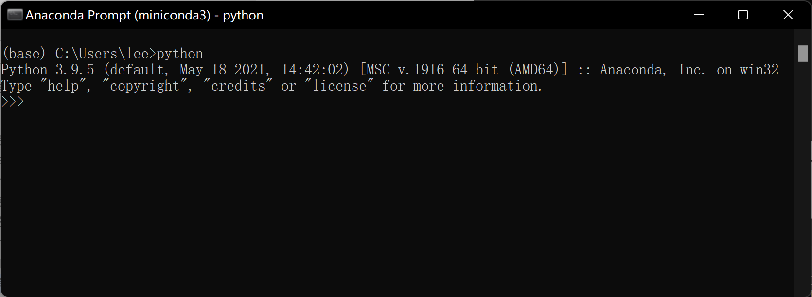
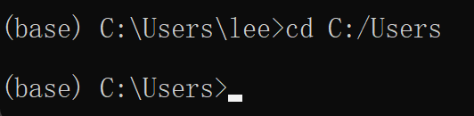

# Python程序的执行

## 一个Python程序是什么

我们所谓“写一个Python”程序，到底是在写一个什么东西？

一般情况下，所谓一个Python程序，仅仅是一个你电脑里的**纯文本文件**，但[扩展名](#ext_name)是`*.py`，这个文件本质上一个`.txt`文件没什么不同，都可以用任何文本编辑器（例如你电脑里的“记事本”）打开和编辑。

我们要做的工作，就是用一个文本编辑器（当然也可以是一个集成编程环境如后面会用到的Spyder），编辑一个`.py`文件，然后把你要的代码写进去，用不同的方法去执行这个文件里代码。可能是在系统里一次性执行整个文件里所有代码，也可能是在一个交互环境里一步一步地执行。

### 基础知识：扩展名和文件类型 {#ext_name}

用于表示某个文件是什么类型，一般我们会看文件名的最后一个英文`.`以及之后的内容。

**注意**：这里只是泛泛而论。扩展名也是可以修改的，所以未必和实际的文件类型一致。

1. 一个文件，其名为`WINWORD.EXE`，其扩展名为`.exe`（Window系统的文件名不区分大小写，但Mac系统的文件名严格区分大小写），则意味着这是一个“Windows系统的可执行文件”。这实际上是微软Windows版本office中的Word的主程序。我们（在windows下）常说的“运行一个程序”，就是执行一个exe文件。
2. 一个文件，其名为`鲁迅全集.txt`，其扩展名为`.txt`，则意味着这是一个“纯文本文件”，其中的所有内容都可以视为文字，可以用任何一个文本编辑器，例如记事本，或者Word打开。
3. 其他扩展名，如`.jpg`是常见的图形文件，`.docx`是2007版本以后的Word文档，等等等等。

## Python的交互式环境 {#python_interactive}

我们先采用最基本的Python的交互式环境，给大家一点运行程序的感觉。 

1.	启动Anaconda Prompt。（用Mac的同学，启动终端terminal）


2. 我们会看到命令行窗口


3. 输入`python <回车>`，我们可以进入python的交互式运行环境。

<span style="color:red">**注意：**</span>
其中的命令提示符`>>>`。三个右侧尖括号，表示**我们正处于python的交互式环境中**，此时我们可以执行python的语句。

同时可见Python的版本为3.9.5，一般3.7.x以上皆可。





### 简单的编程：计算1 + 2 
1. 我们依次输入（每行代码以<回车>结束）

```{}
>>> a = 1
>>> b = 2
>>> c = a + b 
>>> print(c)
```

显然，1+2必然得到

```
3
```


2. 结果大致如图


<span style="color:red">**注意：**</span>

* 无法得到结果`3`，首先检查有没有**输入错误（打错字）**。
* `print(c)`中的小括号，是英文括号。在语法层面上的所有符号，都是**英文符号**。
* 如果输入的代码有误，已经敲了回车，只要把正确代码的再输入一次即可。


### 上述程序中涉及的一些概念


这个涉及程序设计的几个基本概念：

1. 变量和赋值

变量，顾名思义，一个可变的量。编程中变量的概念和代数中的`x`, `y`, `z`基本一样。
Python中，对变量赋值使用1个等号 “`=`”。
	显然， 我们有3个变量，`a`, `b`和`c`。我们把`1`赋予`a`，`2`赋予`b`，把`a + b`的值赋予`c`。

2. 运算符

加减乘除，以及逻辑运算如是否等于，大于，小于等，我们以后会用到。这里只用到“加法”

3. 函数

和数学函数一样，我们调用一个函数，给这个函数传递一个参数，然后这个函数会根据这个参数做一些事情。可能是为你进行一个计算，可能修改某个变量等等，也可能什么都不做。

这里我们调用的函数是`print()`，这个函数的用途是把你传递给他的变量`c`的值打印出来。函数的调用方法是函数名与小括号。

**数据分析的程序，大部分情况下可以视为由变量和函数组成。**

### 退出运行环境

输入`exit()`，然后回车即可。

可见，`exit`本身也是一个函数（函数名+小括号），其调用这个函数的作用是退出Python交互式运行环境。


<span style="color:red">**注意：**</span>一定要退出，以便后续的程序能执行。

此时，我们又回到了一开始的命令行（终端）环境中


可见，命令提示符现在是一个`>`，这提示我们正处于系统的命令行环境中

1. 可以执行系统中的命令，但不能执行python中的语句！
2. 要进行交互式的python编程，要首先进入[Python的交互式环境](#python_interactive)中！


## 预备知识


### 路径Path

*你的文件或者文件夹（目录），到底保存到了哪里？*

所谓路径(path)，到达某个文件或者文件夹（目录）的层级结构，每一层用一个斜杠“`/`”分割。


在命令行（终端）环境下，在命令提示符`>`之前，一般会有提示你当前路径，即当前你处于哪个目录下。

例如 `C:\Users\lee`，指的就是，在你的`C`盘下，`Users`目录下，的`lee`目录。

<span style="color:red">**注意：**</span>在你的电脑上，这里的`lee`会替换为你的用户名


这样，你输入的任何命令，都会对“当前路径”生效。

同样，路径既可以指向一个目录（文件夹），也可以指向一个文件。

如`C:\Users\lee\add.py`，就指的是，在你的`C`盘下的`Users`目录下的`lee`目录下的一个叫`add.py`的文件。

### 相对路径和绝对路径

1. 绝对路径：从根目录（windows下即一个盘符，如c盘或者d盘）开始的路径，可以确定无疑地指向某个文件或者目录。如`C:\Users\lee\add.py`。
2. 相对路径：不从根目录起始的路径。其指向的目的地，从你的“当前路径”开始，往下数。

假如，你的当前路径是`C:\Users`，那么此时，相对路径`lee\add.py`，所指向的，就是当前路径下（`C:\Users`），`lee`目录下的`add.py`。这也等价于绝对路径`C:\Users\lee\add.py`。

3. 两者的区别：绝对路径从根目录开始，相对路径从“当前路径”开始。

### 进入某个目录

Windows命令行，和Mac的终端，有相同的命令`cd <路径>`，可以进入一个目录。

如，在终端中输入（并回车）注意这里使用的是绝对路径
```
cd C:/Users 
```
则会让终端进入到 `C:/Users` 目录下。见提示符`>`前方的“当前路径”已经改变为`C:/Users`。你现在已经位于`C:/Users` 目录。



尝试相对路径，在终端中输入（并回车），注意这里的`lee`，请替换成你的用户名。

```
cd lee
```
则会让终端进入到 `C:/Users/lee` 目录下。见提示符`>`前方的“当前路径”已经改变为`C:/Users/lee`。你现在已经位于`C:/Users/lee` 目录。


其他用法包括：

1. 进入上一级目录

```
cd ..
```

2. 进入根目录

```
cd /
```

可以让你在命令行和终端中，定位到你想要的目录和文件。

### 用Windows图形界面获得路径 {#use_win}

在你的windows资源管理器（俗称“我的电脑”），在任何一个文件夹中，点击地址栏


你就可以得到这个文件夹的路径，可以粘贴到命令行中。


<span style="color:red">**特别注意：正反斜杠问题**</span>

在编程的语境下，反斜杠“`\`”有特殊用途。因此，表示路径的时候，我们统一用（正）斜杠“`/`”，而不用反斜杠“`\`”。

统一的写法，如`C:/Users/lee`

## 用Python解释器来运行


当你离开交互环境，你的程序就没了。当然，我们不可能每次都把程序从头写一次。如前文所述，我们编写一个`.py`文件来保存我们的代码，然后利用系统中安装的Python解释器来执行它。

### 编写源代码

前面说过，python的代码文件`.py`是一个和`.txt`同样的纯文本文件，所以我们这次直接用记事本来编辑。

打开windows的记事本，把刚才的1 + 2程序写进去,按ctrl+s保存

```{python eval=FALSE}
a = 1
b = 2
c = a + b
print(c)
```


1. 在`C`盘根目录下，建立一个新的文件夹，例如“`PythonClass`”。
2. 类型选择*.*（所有文件），文件名可以任意起，但是必须以`.py`结尾。例如我这里采用`add.py`。
3. 保存。

注意：

1. 如果你按此操作，那么你的`PythonClass`文件夹的完整路径（绝对路径）就是`C:/PythonClass`。而你的`.py`文件的完整路径，就是`C:/PythonClass/add.py`
2. 如果你自行选取其他位置保存`.py`文件，那么路径也可以如此类推。如果实在找不到，则可见[在Windows图形界面获得路径](#use_win)。

### 执行这个代码

确保你刚才已经退出了Python的交互环境。我们现在首先要定位到我们保存`.py`文件的目录，如果大家按操作运行，这个文件应该在`C:/PythonClass`目录下。
我们`cd`命令，转移到我们保存`py`文件的路径：

输入 (并回车)
```
cd C:/PythonClass

```

此时你的命令提示符应该告诉你，现在位于`C:/PythonClass`目录下。


```
C:\PythonClass>_
```

输入（并回车）

```
python add.py

```

如果一切顺利，你将会看到结果
```
3
```

而不同之处在于，我们的程序这次保留了下来，我们要继续上一次编程，我们只要打开这个py文件，继续往里写代码即可。

那如果我们既要保存代码，又要一边执行代码、一边看结果怎么办？


