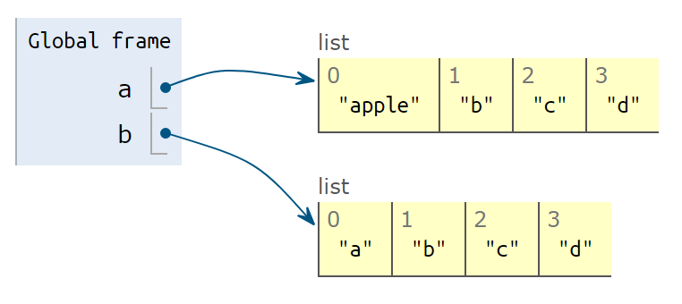

# 常用数据结构

数据结构：是计算机中存储、组织数据的方式。（几乎是废话）

例如“新华字典”：

1. 数据就是每一个字的解释
2. 组织方式是按拼音，顺序排列
3. 一个索引（目录），以供你查找数据。

Python中的`Dict`与之类似，后面详细解释。


## 列表List

一个列表List，就是把几个元素(items)，用一个**固定的顺序**连在一起的数据结构。列表List是一个重点，超级常用，内容比较多。

### 列表的创建
创建一个列表，可以用中括号`[]`，其中每一个元素用逗号分开。

为了好看，建议每个逗号后加一个空格。

```{python}
#%% 列表List
numbers = [1, 2, 3, 4, 5, 6]
letters = ["a", "b", "c", "d"]
print(numbers)
print(letters)
```

列表中的元素，可以混合多种类型。`r red("但一般不建议这么做")`。
```{python}
a_list = [1, 2, 3, "a", "b", "c"]
print(a_list)
```

我们还可以创建空List。比如，当列表的第一个元素还没确定，而你要先行创建列表，然后再生成元素添加进去。
```{python}
#%% 空列表
empty_list = []
empty_list = list()
print(empty_list)
```

对一个字符串String 使用list()函数，可以把字符串分解成字母组成的List。这本质上就是类型转换：用类型的名字做转换函数的名字。

如果把函数名`list`看成是一个动词，或者可以解释成：list a string。

```{python}
#%% 
print(list('apple'))
```
`r red("注意")`：实际上，list()可以用于所有类型的序列（有序列结构的其他数据），以后我们遇到回说。


特别地，如果我们转换一个多行的字符串，会发现什么？

```{python}
a = '''hello
python
'''
print(list(a))
```
注意，换行符`\n`也出现在其中。实际上，应该把换行符之类的不可见字符也看成一个真正的字符，实际上**存在**，但部分情况**不可见**而已


### 列表的元素

要引用一个列表的元素，也使用`[]`，其中包括元素的索引(index)，注意第一个元素的索引是0（Python和c语言一样，从0开始计数）


```{python}
print(numbers)
print(numbers[0])
print(numbers[3])
```
可以反向引用元素，例如`-1`指向最后一个元素，`-2`指向倒数第二个，如此类推

```{python}
print(numbers)
print(numbers[-1])
print(numbers[-2])
```


列表中的元素是可变的。同样，用等号`=`对某个元素赋值即可


```{python}
print(numbers)
numbers[0] = 999 # 修改第一个元素的值为999
print(numbers)
```
添加元素

在List的最后添加元素可以用`.append()`。添加多个元素，可以用`.extend()`，注意`extend`使用一个list作为参数。插入元素到指定索引号`.insert()`

```{python}
letters = list("abcd")
print(letters)


letters.append('e')# 添加一个元素
print(letters)


letters.extend(['f','g']) #添加多个元素：把要添加的元素放进一个list里
print(letters)


letters.insert(3,"apple") #元素插入到指定索引的位置
print(letters)
```

移除：移除某个元素，使用`.remove()`；按照索引移除`del`

```{python}

print(letters)
letters.remove('apple') # 如果'apple'不存在，会抛出错误：ValueError: list.remove(x): x not in list
print(letters)

del letters[0]
print(letters)
```

### 注意：List的拷贝

这部分可能有点抽象。

1. 变量名是个标签
2. 变量赋值，给内存中的一个数据“贴标签”
3. 那用一个变量，给另一个变量赋值会如何？


以一个数字来举例

```{python}
a = 123
print(a)

b = a 
print(b)

a = 321
print(f'a is {a}\nb is {b}')

```

中间发生了什么

1. `a = 123`

创建了一个整型对象，里面存放了`123`，把`a`这个名字绑定到这个对象上。

2. `b = a`

把`a`这个标签，所指代的对象，再贴一个标签`b`。这个时候,`a`和`b`都指向这个整型对象，里面存放了`123`。

3. `a = 321`
创建了一个新的整型对象，里面存放了`321`，把`a`这个名字，重新绑定到这个对象上。

现在 `a -> 321`，`b -> 123`


但List比较特殊

以letters来举例：
```{python}
a = ["a", "b", "c", "d"]
print('a is ', a)

```

1. 变量`a` 指向 `["a", "b", "c", "d"]`


```{python}
b = a 
```


2. 变量`b` 指向`a`相同的数据`["a", "b", "c", "d"]`

```{python}
a[0] = 'apple'
print('b is ', b)

```


3. 你修改了列表`a`的值，`b`的值也改变了！因为`a`和`b`一直指向同一个对象。 


4. 如果要避免这种情况，要明确地把`a`**复制**一次，

```{python}
a = ["a", "b", "c", "d"]
b = a.copy()
print(f'a is {a}\nb is {b}')
```


```{python}
a[0] = 'apple'
```


```{python}
print(f'a is {a}\nb is {b}')
```


这样就不会互相干扰了。

总结：

1. Number ,String,Tuple等，是“不可变类型”：修改这个变量，会创建一个对象，然后重绑定（转贴标签）
2. List等，是“可变类型”：修改里面的值，其实是“**原地修改**”，导致所有指向这个数据的变量都发生改变。
3. 要避免上述情况，请明确地复制原List一次。


### List的切片

如何获取一个List中的一段？

```{python}
a = list('abcdef')
print(a)
```

截取：从第2个元素开始到第4个元素：（证券答案应该是`['b', 'c', 'd']`

`a[起点的索引 : 终点的索引-1]`

如：
`a[1:4]`：切片起止点：包含起点（1号，即`b`），不包含终点（不含4号，即`e`）


```{python}
print(a[1:4])
```

可以不写起点或者终点，默认是到一边的尽头

```{python}
print(a[:4]) # 4号元素之前（0，1，2，3）（不包含终点）
```

```{python}
print(a[3:]) # 3号元素以及之后（3，4，5）（包含起点）
```

可以倒数切片：

如从倒数第二个元素开始到最后
```{python}
print(a[-2:]) # 倒数第二个元素开始到最后（包含起点）
```
从头切到倒数第二个元素（不含终点）
```{python}
print(a[:-2]) # 从头切到倒数第二个元素（不含终点）
```


切片赋值 ： 直接覆盖原理位置的值，可以不等长

```{python}
a = list('abcdef')
print(a[2:4])

```

注意：`a[2:4]`只有2个值，但我们替换成不等长的其他List，如替换3个值进去

```{python}
a[2:4] = ['x','y','z']
print(a)
```

这使得`['c', 'd'] -> ['x', 'y', 'z']`

赋予空列表，可以达到删除的效果。

```{python}
a[2:5] = [] # x,y,z是2，3，4号
print(a)
```

还可以按步长切片

`a[起点:终点:步长]`

步长默认为1（每个元素都取值），如果设置为2，每2个元素取一个值

```{python}
a = list('abcdefgh')
print(f'''a        is {a}
a[1:6]   is {a[1:6]}
a[1:6:2] is {a[1:6:2]}
''')

```


## 元组

## 字典

## 类型提示Type Hints
