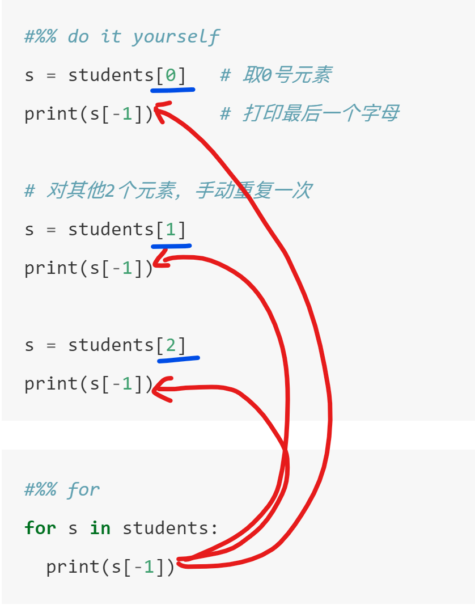

# 条件与循环（施工中）

## 条件if

### 多行if


```{python}
price = 102
if price <100:
  print ('buy')
elif price < 110:
  print ('hold')
elif price < 120:
  print ('think about it')
else:
  print ('sell')

```

### 单行if
```{python}
price = 70
if price<80: print('buy')

```

### 三元表达式

```{python}
price = 85
'buy' if (price<80) else 'don\'t buy'
```

### 练习


小明身高1.75m，体重80.5kg。请根据BMI公式（体重除以身高的平方）帮小明计算他的BMI指数，并根据BMI指数：

1. 低于18.5：过轻
2. 18.5-25：正常
3. 25-28：过重
4. 28-32：肥胖
5. 高于32：严重肥胖


用if-elif判断并打印结果：


小提示：

```{python}
height = 1.75
weight = 80.5

# 计算BMI指数
# 用 if-elif 判断，并打印结果


```

判断闰年：从year, 判断是否为闰年?

注：能被4整除但不能被100整除的 或者 能被400整除 那么就是闰年

```{python}
year = 2005 # 或者任何一年
```


### 嵌套if

例子：用if-else求a、b、c 3个数中最大的一个

思路：

1. 比较a和b
1.1. 若a较大，则比较a和c
1.2. 若a较小，则比较b和c


```{python}
a = 4
b = 9
c = 2

if a>b:
  if a>c:
     max_value=a
  else:
    max_value=c
else:
  if b>c:
    max_value=b
  else:
    max_value=c
  
print(f"最大值是{max_value}")     
```

<iframe width="800" height="500" frameborder="0" src="https://pythontutor.com/iframe-embed.html#code=a%20%3D%204%0Ab%20%3D%209%0Ac%20%3D%202%0A%0Aif%20a%3Eb%3A%0A%20%20if%20a%3Ec%3A%0A%20%20%20%20max_value%3Da%0A%20%20else%3A%0A%20%20%20%20max_value%3Dc%0Aelse%3A%0A%20%20if%20b%3Ec%3A%0A%20%20%20%20max_value%3Db%0A%20%20else%3A%0A%20%20%20%20max_value%3Dc%0A%20%20%0Aprint%28f%22%E6%9C%80%E5%A4%A7%E5%80%BC%E6%98%AF%7Bmax_value%7D%22%29%20%20%20%20%20&codeDivHeight=400&codeDivWidth=350&cumulative=false&curInstr=7&heapPrimitives=nevernest&origin=opt-frontend.js&py=3&rawInputLstJSON=%5B%5D&textReferences=false"> </iframe>

### 练习

对一个变量number，判断是否能被2或者3整除

按具体的情况，请输出：

1. "你输入的数字可以整除 2 和 3"
2. "你输入的数字可以整除 2，但不能整除 3"
3. "你输入的数字可以整除 3，但不能整除 2"
4. "你输入的数字不能整除 2 和 3"        
            

思路：
1. 先看看2
2. 再看看3

```{python}

```


### 再谈布尔值


前面讲过，布尔型有2种，真`True`和假`False`。

实际上，这2个符号，是**布尔型变量的值**，和`1,2,3,4`是整型的值，`'apple'`是字符串的值类似。但布尔型的值只有2种。


例如，有一个变量，用于表示“现在是否下雨”。这个问题只要2个答案，是或者否，显然这就可以用布尔型来表示：`True`就表示下雨，`False`就表示没下雨。我们就定义一个布尔型变量`is_raining`。

注意：为了达到顾名思义的效果，布尔型的变量，可以考虑用`is_`，`has_`等等开头，显示这是个“是否”问题的答案。


```{python}
# 表示现在正在刮风下雨
is_raining = True 
is_blowing = True

```
判断是否同时在刮风和下雨
```{python}
print(is_raining and is_blowing)
```


布尔运算，其结果，也是一个布尔类型的变量：因此可以赋值给另一个变量。

`bad_weather`

```{python}
bad_weather = is_raining and is_blowing # 布尔运算的结果，也是一个布尔型，并且可以赋值给另一个变量
print(bad_weather)
```

换一种理解，你可以把`and`运算，看成一个函数。类似于：

```
bool_and(x, y)
```

就可以视为一个函数调用，返回的结果，就是与操作

```{python eval=FALSE}
bad_weather = bool_and(is_raining and is_blowing) # 这是随便写的，无法执行
```

回到我们的`if`语句。`if`语句接受的判断条件，本质上一个**布尔型变量**

```{python}
if is_raining and is_blowing:
  print('don\'t go outside!')
```

```{python}
if bad_weather:
  print('don\'t go outside!')
```


所以，你在`if`后面跟一个布尔型变量`bad_weather`，或者一个条件`is_raining and is_blowing`，是等价的。

回看前面的例子：
```{python}
a = 2
b = 3
if a > b: 
  print('a > b')
else:
  print('a <= b')
```
可以把`a > b`看成是“一个布尔型的变量”，这个变量，保存了`a > b`的结果，只是我们没有把这个结果赋值给一个变量名（没有绑定一个标签），而是直接放进了`if`语句中。

这等价于：

```{python}
a = 2
b = 3

is_a_bigger = a > b 

if is_a_bigger: 
  print('a > b')
else:
  print('a <= b')

```

小结，布尔运算，实际上会返回一个新的布尔值，可以和任何变量一样进行操作，比如绑定名字，放进if里等等

## while循环

while循环比较直观，“**只要条件成立，就重复执行某块代码块**”

或者说，“**重复执行某块代码块，直到条件不成立为止**”

```{}
while 判断条件(condition)：
    执行语句(statements)
```


### 举例：打印 1到10 

思想：

1. 要把10以内的所有自然数都过一次，肯定要用循环
2. 设计一个变量，用来做计数器，比如i
3. 每次循环中，计数器累加1，直到10为止，停止循环
4. 每次循环中，打印这个数


* 注：让变量自增的运算符号是`+=`

例如 `i += 2`即让`i`自增2，等价于 `i = i + 2`

```{python}
i = 1
i += 999
print(i)
```


设计一个从1到5的循环
```{python}
i = 1
while i <= 5:
  print(i)
  i +=1 
else:
  print("循环结束")
```

<iframe width="800" height="500" frameborder="0" src="https://pythontutor.com/iframe-embed.html#code=i%20%3D%201%0Awhile%20i%20%3C%3D%205%3A%0A%20%20print%28i%29%0A%20%20i%20%2B%3D1%20%0Aelse%3A%0A%20%20print%28%22%E5%BE%AA%E7%8E%AF%E7%BB%93%E6%9D%9F%22%29&codeDivHeight=400&codeDivWidth=350&cumulative=false&curInstr=0&heapPrimitives=nevernest&origin=opt-frontend.js&py=3&rawInputLstJSON=%5B%5D&textReferences=false"> </iframe>

### 练习

1. 打印 1到10 中的偶数。

小提示：如何判断一个数是否是偶数？取余的操作符是`%`


```{python}


```


2. 利用循环，求1到100的累加，计算完成最后打印出来

小提示：你可以建立一个新的变量，用来存放累加的结果

```{python}


```

## for循环

### 如果没有for循环

例如，有一个班级同学姓名的列表，我们要打印每一个同学姓名的最后一个字母。

```{python}
students = ["Alex", "Bob", "Clare"]
print(students)
```

没有循环的时候，我们怎么做？

我们可能会尝试，把students这个列表，按索引号，逐一取出，然后再打印首字母

```{python}
len(students)
```
知道students里有3个同学，我们就知道，索引号（index）是0，1，2。


现在我们用最笨的办法，逐一取出，逐一打印

```{python eval=FALSE}
s = students[0]   # 取0号元素
print(s[-1])      # 打印最后一个字母

# 对其他2个元素，手动重复一次
s = students[1]
print(s[-1])

s = students[2]
print(s[-1])

```
```
x
b
e
```

<iframe width="800" height="500" frameborder="0" src="https://pythontutor.com/iframe-embed.html#code=students%20%3D%20%5B%22Alex%22,%22Bob%22,%20%22Clare%22%5D%0A%0As%20%3D%20students%5B0%5D%20%20%20%23%20%E5%8F%960%E5%8F%B7%E5%85%83%E7%B4%A0%0Aprint%28s%5B-1%5D%29%20%20%20%20%20%20%23%20%E6%89%93%E5%8D%B0%E6%9C%80%E5%90%8E%E4%B8%80%E4%B8%AA%E5%AD%97%E6%AF%8D%0A%0A%23%20%E5%AF%B9%E5%85%B6%E4%BB%962%E4%B8%AA%E5%85%83%E7%B4%A0%EF%BC%8C%E6%89%8B%E5%8A%A8%E9%87%8D%E5%A4%8D%E4%B8%80%E6%AC%A1%0As%20%3D%20students%5B1%5D%0Aprint%28s%5B-1%5D%29%0A%0As%20%3D%20students%5B2%5D%0Aprint%28s%5B-1%5D%29&codeDivHeight=400&codeDivWidth=350&cumulative=false&curInstr=7&heapPrimitives=nevernest&origin=opt-frontend.js&py=3&rawInputLstJSON=%5B%5D&textReferences=false"> </iframe>

显然，

1. 如果元素很多，这就是个不可能完成的任务。
2. 这个做法，重复的代码太多，必然可以得到精简

### 用while循环？

我们前面学了while循环，我们尝试用while来做完成

1. 同样，一个计数器i，记录了索引号，从0，到`len(student) - 1 ` = 2
2. 每次循环，用`students[i]`来取出对应的元素
3. 打印最后一个元素
4. i += 1，循环

```{python}
i = 0

while i < len(students): # 注意，这里是 i < 3 
  s = students[i]        # 即i = 0, 1, 2
  print(s[-1])
  
  i += 1

```

<iframe width="800" height="500" frameborder="0" src="https://pythontutor.com/iframe-embed.html#code=students%20%3D%20%5B%22Alex%22,%20%22Bob%22,%20%22Clare%22%5D%0A%0Ai%20%3D%200%0A%0Awhile%20i%20%3C%20len%28students%29%3A%20%23%20%E6%B3%A8%E6%84%8F%EF%BC%8C%E8%BF%99%E9%87%8C%E6%98%AF%20i%20%3C%203%20%0A%20%20s%20%3D%20students%5Bi%5D%20%20%20%20%20%20%20%20%23%20%E5%8D%B3i%20%3D%200,%201,%202%0A%20%20print%28s%5B-1%5D%29%0A%20%20%0A%20%20i%20%2B%3D%201&codeDivHeight=400&codeDivWidth=350&cumulative=false&curInstr=15&heapPrimitives=nevernest&origin=opt-frontend.js&py=3&rawInputLstJSON=%5B%5D&textReferences=false"> </iframe>

### 用for循环
```{python}
for s in students:
  print(s[-1])

```


<iframe width="800" height="500" frameborder="0" src="https://pythontutor.com/iframe-embed.html#code=students%20%3D%20%5B%22Alex%22,%22Bob%22,%20%22Clare%22%5D%0A%0Afor%20s%20in%20students%3A%0A%20%20print%28s%5B-1%5D%29%0A&codeDivHeight=400&codeDivWidth=350&cumulative=false&curInstr=8&heapPrimitives=nevernest&origin=opt-frontend.js&py=3&rawInputLstJSON=%5B%5D&textReferences=false"> </iframe>


### 比较

比较for循环，和手动操作

```{python eval=FALSE}
#%% do it yourself
s = students[0]   # 取0号元素
print(s[-1])      # 打印最后一个字母

# 对其他2个元素，手动重复一次
s = students[1]
print(s[-1])

s = students[2]
print(s[-1])

```


```{python eval=FALSE}
#%% for
for s in students:
  print(s[-1])

```



上述for循环完成的事：

1. 自动把s指向students中的0号元素，对s执行你的代码（打印最后一个字）
2. 自动把s指向students中的1号元素，对s执行你的代码（打印最后一个字）
3. 自动把s指向students中的3号元素，对s执行你的代码（打印最后一个字）
4. ...


### for循环

for循环一般用于遍历一个可迭代对象（简单理解，就是如 List、Tuple和Dict这样具有序列结构的数据）

其作用是“对其中的每一个元素都做点什么”。

如果你要对一个List中的每一个元素都做点什么，此时就应该用for循环。


例如，我们要打印`a = [1,2,3,4,5]`中的每一个元素

或者说，我们要对`a = [1,2,3,4,5]`中的每一个元素，执行打印这个动作。


```{python}

a_list = [1,2,3,4,5]

for i in a_list:  
  print(i)
  

```

解释

1. 目标：对`a = [1,2,3,4,5]`中的每一个元素，执行打印这个动作。
2. `a_list`是一个列表的名字
3. `for i in a_list: `：我们把中的每一个元素，按顺序，逐个过一遍。轮到哪个元素，我们就用`i`来指向它。
4. `  print(i)`：由上一句，`i`可以看作每一个元素代称，我们打印它。注意，前面由“1个缩进”。


<iframe width="800" height="500" frameborder="0" src="https://pythontutor.com/iframe-embed.html#code=a_list%20%3D%20%5B1,2,3,4,5%5D%0A%0Afor%20i%20in%20a_list%3A%20%20%0A%20%20print%28i%29&codeDivHeight=400&codeDivWidth=350&cumulative=false&curInstr=0&heapPrimitives=nevernest&origin=opt-frontend.js&py=3&rawInputLstJSON=%5B%5D&textReferences=false"> </iframe>


break

```{python}
a = [1,2,3,4,5]

for i in a:
  if i < 4:
    print (i)
  else:
    print('从这里断开！')
    break
else:
  print('循环完成！')

```


### range的循环


`range(起点, 终点, 步长)`：快速生成一个序列：惰性的（lazy）可迭代序列

1. `range(0,10)`：生成一个0 ~ 9的自然数序列（包括起点，不包括终点）
2. `range(0,10,2)`：生成一个0 ~ 8的偶数序列（包括起点，不包括终点）
3. 可以转为List，如:

```{python}
print(range(0,10))
print(list(range(0,10))) 
```

但是，range不用转换为List，也可以使用！

如：按索引取值，或者切片(range切片会得到另一个range)等等

```{python}
print(range(10,15)[2])
print(range(10,15)[2:4])
```

也可以替代List，用在for循环中，常用于快速生成一个数字序列

```{python}
for i in range (1,10,2):
    print ('奇数是: ',i) 

```


## 更多练习
求1~100之间能被7整除，但不能同时被5整除的所有整数。For和While版本

求列表（或者元组）平均值。For和While版本
```{python}
score = [70, 90, 78, 85, 97, 94, 65, 80]

```
进阶思考题：二分查找法

对于一个排序的List，找到某一个元素的位置

思路

1. 找到列表的中间位置的元素
2. 比较这个元素，和目标的大小。如果一样大，得到位置。
3. 根据大小，把范围缩小到List前半段，或者后半段
3. 在新的区间，回到1. 重复这个过程


```{python}
a = [ 5,8,15,20,30,45,78,100,120,200 ]
target = 30

```


## 列表推导式List Comprehension

更详细的内容见后。

遍历List，并进行某个操作

`do_something(i) for i in a_list`

```{python}
s = ['abc','abcd','bcde','bcdee','cdefg']
[x.upper() for x in s]
```

遍历List，找出符合条件的值，并对其进行某个操作

`do_something(i) for i in a_list if condition(i)`


```{python}
old_list    = ['abc','abcd','bcde','bcdee','cdefg']
matching = [ x.upper() for x in old_list if 'bcd' in x ]
print( matching )
```

## 循环Dict
```{python}
d = {"x": 1, "y": 2}
for key in d:
  print(key, d[key])

```
