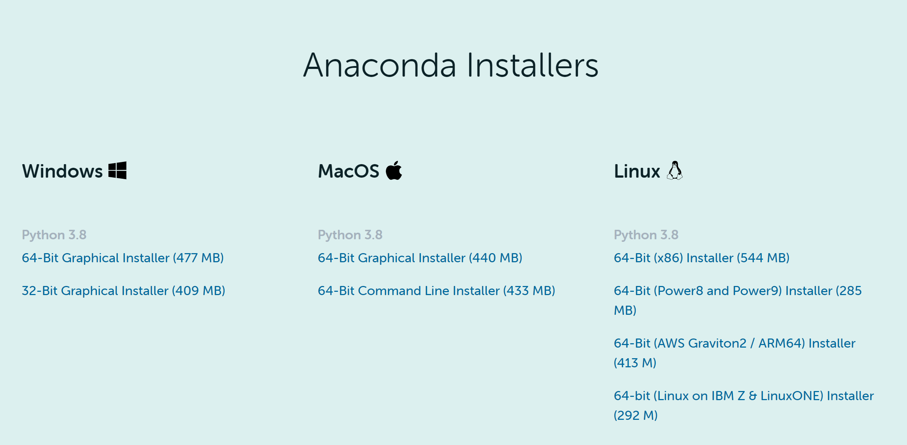

--- 
title: "写给文科生的Python入门和数据处理教程"
author: "Li Weicheng @ gpnu"
date: "`r Sys.Date()`"
site: bookdown::bookdown_site
documentclass: book
#bibliography: [book.bib, packages.bib]
# url: your book url like https://bookdown.org/yihui/bookdown
# cover-image: path to the social sharing image like images/cover.jpg
description: "为人文社科类研究员和学生设计的的Python入门和数据处理教程"
link-citations: yes
# github-repo: rstudio/bookdown-demo
---

```{r}
colorize <- function(x, color) {
  if (knitr::is_latex_output()) {
    sprintf("\\textcolor{%s}{%s}", color, x)
  } else if (knitr::is_html_output()) {
    sprintf("<span style='color: %s;'>%s</span>", color,
      x)
  } else x
}
```

# 引言 

本文是Python入门和数据处理教程，基于经管类本科课堂教学用的讲义，以供同学们自学和参考。

*p.s.* 本文使用RStudio以及R的Bookdown包写成。

## 本书目标

1. 负基础Python入门

对于首次接触编程的人，可能对计算机和操作系统的有关知识（如“命令行”，“路径”等）缺乏了解。本文尽量把有关的知识都介绍到，争取做到“会打字就能学Python”。

2. Python数据处理

* 基本目标：替代Excel
* 进阶目标：对科研常用数据，如Wind和CSMAR数据库、CFPS和CHIP等微观调查数据、统计局数据、oTree实验数据等，按照研究要求进行清洗、剪裁、整合以及绘图，为进一步分析（如回归）制作出合适的数据集。

3. 金融数据分析

待定：视教学情况。

## 本书不足

1. 由于课时非常紧张，有很多有意义的内容不得不舍弃，包括但不限于：

* 函数式编程和数据流思想
* 面向对象编程
* 单元测试

2. 作者水平有限，很多内容未必是最优做法，只能争取尽量清晰和明确。
3. 要顾及同学们的计算机基础有高有低，有些地方不得不写得比较啰嗦。

## 使用的程序和版本


1. 使用Anaconda以及附带的Spyder作为主要的编程环境
2. Python版本3.6或以上。（涉及Type Hints和f-string等）


## 把Python安装到你的电脑里

要完成任何一个编程任务，首先要借助Python现有的巨大的程序库（一般可称为库Library，或者包Package）。本课程主要针对经济类数据分析，涉及的包比较多。为了避免逐个安装，我们采用比较简单的做法，直接安装Anaconda。这是一个所谓“Python发行版”，里面包含了Python的执行程序（解释器等），以及大量的科学计算用包。一般的数据分析工作，直接安装这个即可。

下载地址：https://www.anaconda.com/products/individual#Downloads

直接百度Anaconda也能找到这个链接。按照你自己的操作系统下载 ，一般选择**最新版**，现在的电脑一般选择**64bit**的安装文件，安装过程采用**默认选项**即可。




